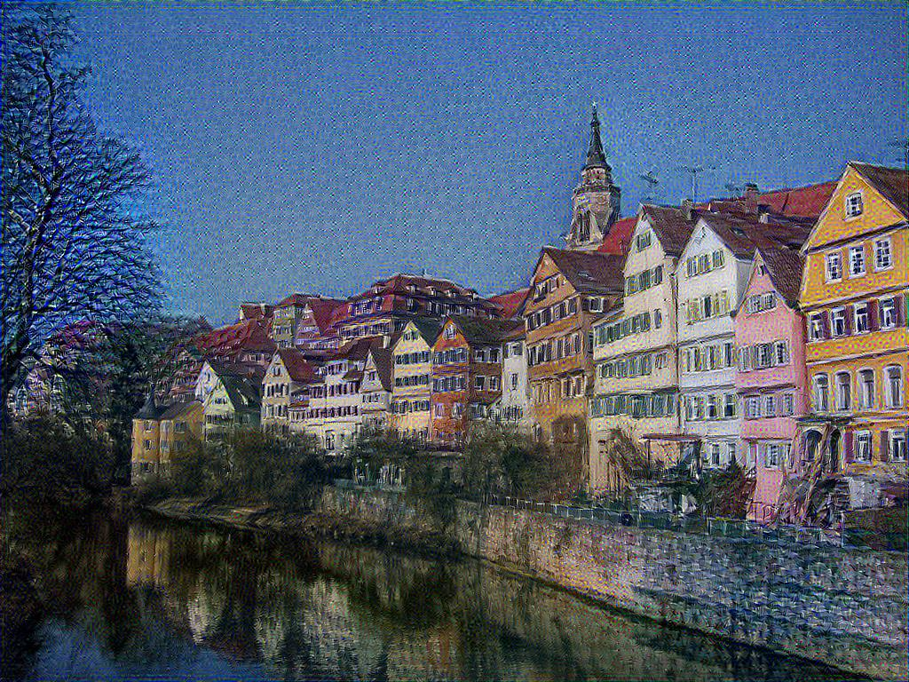

A Neural Algorithm of Artistic Style TensorFlow Implementation
==========================

This is the TensorFlow implementation of the paper [A Neural Algorithm of Artistic Style](https://arxiv.org/abs/1508.06576)


Here is one of our output image.




The file organization is:

```
project/
├── pretrained_model/
├── data/
├── fig/
├── output/
├── main.ipynb
├── train.py
├── utils.py
└── VGG.py
```

To reproduce our result, we could run the notebook file 'main.ipynb'. There are chunks which reproduce different types of result including our output image as well as the training loss history. The animation part comes from my own idea and is also very fancy and worth trying.


### Contribution statement:

The VGG.py and part of uils.py is implemented by Du Guo(<dg2999@columbia.edu>) and the other part is by me, Yiran Jiang(<yj2462@columbia.edu>).


12/15/2018

Yiran Jiang(<yj2462@columbia.edu>)
